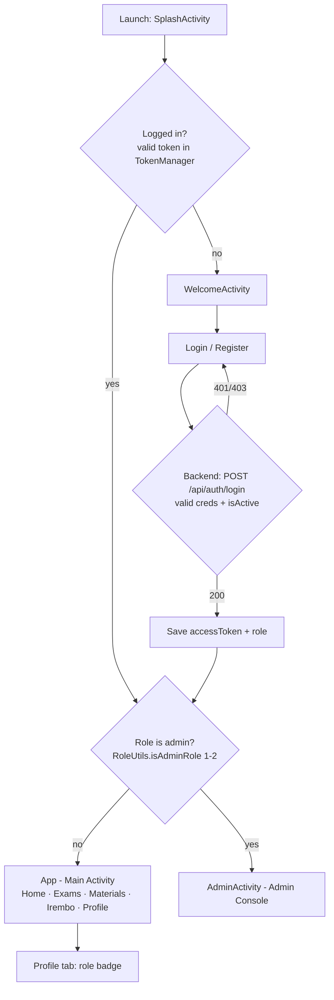
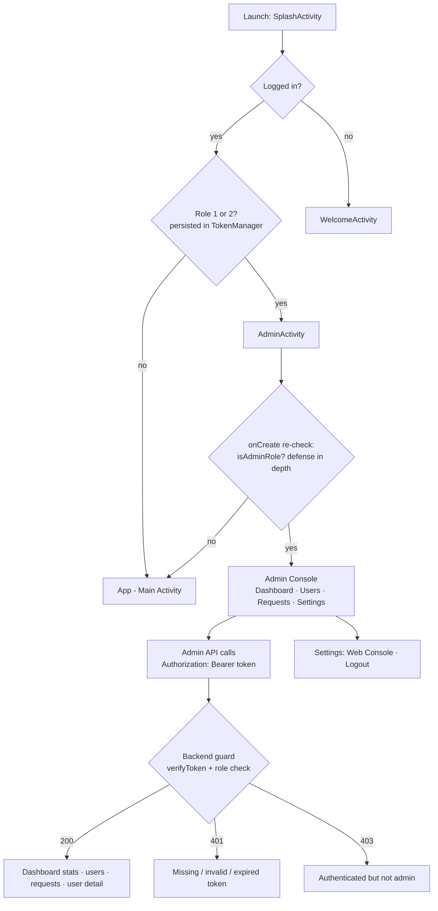
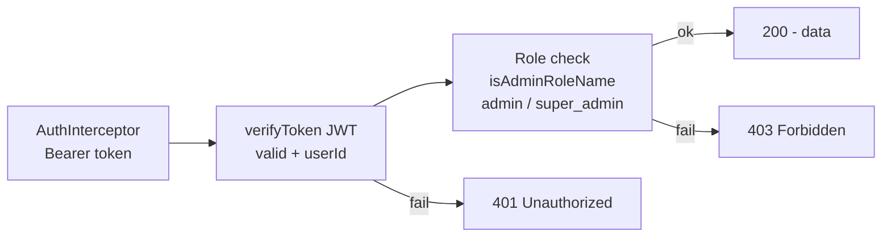

# App Flows — User &amp; Admin

Interactive HTML version: [app-flows.html](./app-flows.html)

**Roles:** regular user = any role ≠ 1/2 (student 5, premium 6, free 7, …) · admin = **super_admin (1)** or **admin (2)**.

## User flow

**Key points**
- **One shared login, role-based landing** — there is exactly one login (user + admin use the same `LoginActivity`); after login the user is routed to the app that matches their role. There is **no in-app switching** between the user app and the admin console: the drawer has no “Admin Console” entry and the admin console has no “Open User App” link. To use the other experience, log out and log back in.
- **Registration is student-only** — `POST /api/auth/register` always creates role 5 (`STUDENT_ROLE_ID`); a client-supplied `role` is ignored. There is no admin registration path.
- The role is persisted via `TokenManager.saveRole` and refreshed on every profile load (`UserRepository.mapUser`), so a server-side role change applies without re-login (the next launch lands in the right app).

## Admin flow

## Backend guard layer — `/api/admin/*`

## Entry points &amp; guards summary

| Entry point | What it does | Guard |
|---|---|---|
| `SplashActivity` | Routes by login state + role | `TokenManager.isLoggedIn`, `RoleUtils.isAdminRole` |
| `LoginActivity` | Login → saves token + role → routes by role | Backend 401/403; admin → AdminActivity |
| `RegisterActivity` | Register → always lands in user App | Backend always creates Student (role 5) |
| `App` (user app) | 5 tabs + drawer; no admin-console entry (role switch requires logout+login) | — |
| `AdminActivity` | 4-tab console; no “Open User App” link (role switch requires logout+login) | onCreate re-check bounces non-admins to App |
| Backend `/api/admin/*` | Dashboard, users, requests, user detail | `verifyToken` + `isAdminRoleName` → 401/403 |
